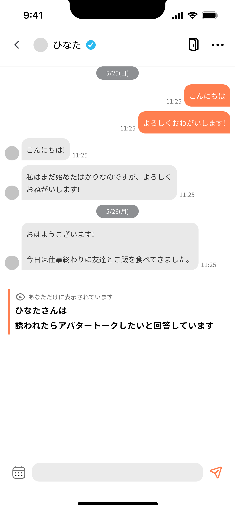

# 基本情報
- 氏名: 設楽広太（しだら こうた）
- 生年: 1997年

# 略歴

期間 | 内容
--- | ---
2019/8 - 2025/10 | 株式会社Flamers 共同創業 / CTO
2017/10 - 2019/6 | ビジネス・エンジニア長期インターン 1社
2016/4 - 2022/3 | 東京大学理科一類 入学 → 工学部社会基盤学科 卒業（2年間の休学）

# 自身の強み
- 創業から累計2億円以上の資金調達を経験しました。事業や開発を経営視点で捉え、会社を主語にした意思決定を行うことを重ねてきました。
- CTOとして、サーバー/インフラ/クライアントの全ての領域で責任が取れるように、常に新しい技術を習得してきました。技術の素早いキャッチアップに自信があります。
- 技術のみならず、UI・UXや事業へのインパクトに関心があります。顧客へのヒアリングや自身の消費者への憑依など、消費者を理解するための一次情報の取得を積極的に行いたい意思があります。
- メンバーに対しては、誠実に向き合い、心理的安全性高く、開発を楽しいと思ってもらいたいという気持ちで接してきました。楽しく働くチームの一翼を担えると思います。

# 技術スタック
## 言語/フレームワーク
- プロダクションのコードを書いた経験があるもの
  - Ruby / Ruby on Rails（7年）
  - C# / Unity（4年）
  - Kotlin / Jetpack Compose（2年）
  - Swift / SwiftUI（2年）
- そこそこ触ったことがあるもの
  - Python（卒論の画像キャプション、numpy、pandas、scikit-learn / Flask / アルゴリズム実装 / ROS 2）
  - Golang（プロダクションでWebRTCを用いたサーバー構築のレビューとBugFixを担当, プライベートでgRPCの学習）
  - JavaScript、TypeScript（プロダクションでRailsのStimulus、GAS、AWS CDKの実装で利用）
- かじった程度
  - Dart / Flutter（技術検証程度）

## クラウドインフラ
- AWS（5年）
  - EC2、ECS、Fargate、Lambda等の基本的なサービスの構築・運用経験
  - CodePipeline、CodeBuild等を利用したCI構築
  - AWS CDKでのIaC構築
- GCP
  - プロダクションで利用するPub/Subの構築（Androidのサブスクサーバー通知）

## その他
- GitHub Actions（実務で利用）
- Docker（実務で利用）
- MySQL（実務で利用）
- Kubernetes（プライベートで学習。Pod、Service、Deployment等の簡単な理解）
- Git, GitHub（実務で利用）
- Dify（実務で利用）
- Figma（利用歴: 半年）

# 株式会社Flamers（2019/8 - 2025/10）
## 活動概要

項目 | 内容
--- | ---
沿革 | 大学在学中に就活起点の課題感から共同創業 → 長期インターンサイトVoilを立ち上げ・黒字化達成 → メタバースマッチングアプリ「[Memotia](https://memotia.com/)」 を立ち上げ
組織 | CTOに就任。エンジニア採用を主導し、10名規模の開発チームを組成（全社では25名ほど）
資金調達 | プレシード〜プレシリーズAで累計2億円超を実施 [HeartDrivenFundよりプレシード調達](https://prtimes.jp/main/html/rd/p/000000001.000053336.html)、[ANRI等から1億円のシード調達](https://prtimes.jp/main/html/rd/p/000000010.000053336.html)
事業 | 集客コストを上回るLTVを獲得することに成功。累計数万人が利用（2025/11現在）

## サーバー/バックエンド

### ポリモーフィック設計
- User/Guestの二系統認証を、コード重複を最小化して実装。

### Apple/Googleのサブスクリプション実装
- サーバー通知・クライアント実装を横断して整備（実装は主にAndroidを担当し他はディレクション）。
- リリース後の実データを検証し、データの信頼性を確認。[検証ログiOS版](https://zenn.dev/link/comments/4ea2cd272e3784)、[Android版](https://zenn.dev/link/comments/1fa236836939ed)

### AWS Lambdaを利用した並列化
- Railsでのmini_magic処理が並列化できず、1分あたり150人の処理要件下で総処理時間が5分超に。ボトルネックをLambdaへ分離し並列化を実現。大規模プロモーションに備えた。

### その他（サーバー）
- Sign in with Appleの実装とディレクションを担当（iOSを自分が実装、Railsをメンバーへ依頼）。[調査ログ](https://zenn.dev/dara/scraps/e659306593b8e7)
- ユーザー同士のリアルタイムマッチメイキングの高速化。事前に相性をバッチ計算し、Redisに保存する機構の実装とディレクションを担当。

## インフラ
### AWS CDKでECS on EC2サーバー構築

- AWS CDKでECS on EC2のサーバーを構築し、CodePipeline／CodeBuildでCIを整備。
- WebRTC通信を行っており、大量のUDPポートを公開する必要があった。Fargateの場合、NLBを構築してポート公開を実現する必要があり、リリースまでの期日を考慮すると学習コストの観点から実現可能性が低いと判断。EC2であればセキュリティグループでポートレンジを開放することで実現できるため、その手段を選択した。

### その他（インフラ）
- [AWS WAF](https://aws.amazon.com/jp/waf/)を用いて、海外からの不正アクセスを遮断。
- ECS on Fargate構成のRailsサーバーのIaC化をディレクション（実装はメンバーが担当）。
- ElasticBeanstalkを利用したサーバー構築を3サービスを主担当として実装（IaC導入以前）。

## クライアント（iOS/Android/Unity）
### モバイルUIとUnityが共存する技術選定

- モバイルUIとUnityの共存のため、Unity as a Libraryを選定・実装。[技術調査ログiOS版](https://zenn.dev/flamers/articles/3cd8f4781b4892)、[Android版](https://zenn.dev/flamers/articles/aeadd5c721a0d6)
- 既存でVRとPCプラットフォームで動作していたアプリを、2.5ヶ月でiOS/Androidともに審査を通過させ、リリースを実現。

### VRマルチプラットフォーム対応
- Meta社のOculusに特化したSDKではなく、多様なVR機器に対応できるOpenXR、Unity XR Interaction Toolkitを選定。
- 当時はVR開発環境も情報が少なく環境も変化していた中で、VR系の開発を行う知人やX上で見かけた方にDMで連絡し、MTGを複数件設定して壁打ちを実施。

## 開発生産性・マネジメント

### CI/CDの構築

- GitHub ActionsでUnity/モバイルのビルドパイプラインを構築（対象プラットフォーム・API向き先・軽量化・開発者モード等の切替が可能）

### チームへのコード生成AI活用促進

- DevinやClaudeCodeの活用を促すMTGを設定し、その場でのハンズオンの実施やプロンプト例などの自作ドキュメントを配布。ほぼ全てのメンバーが利用し、さらにrulesの整備も活性化した。
- 使用感の振り返りMTGを実施し、Devinに関してはフィードバック内容を開発元に送信した。

### スクラムの導入と定期的な見直し

- スクラム開発を導入し、スプリントプランニング、デイリースクラム等のイベントを定着させた。
- 企画と開発に分断を感じたため、プロジェクト毎にPM・デザイナー・エンジニアでショートなMTGを週2回ほど開催。結果、コミュニケーション頻度が増え、意図の伝達がスムーズになり、エンジニアメンバーがより前向きに企画の実装に向き合えるようになった。
- スプリントレトロスペクティブのフォーマットを、KPTから[Fun Done Learn](https://www.ogis-ri.co.jp/otc/hiroba/others/ActivityPocket/FunDoneLearn.html)に切り替えて、より明るい雰囲気にすることを模索した。

### 開発合宿の企画

- リリース目標に対して開発がビハインドしている時期に、任意参加で休日に楽しく稼働してもらえるよう、合宿と銘打った企画を実施した。
- ランチを豪華なものとしたり、進捗をチーム全体に自慢するなどして、楽しいお祭のようなイベントだと感じてもらえるよう工夫した。

### 技術系社内勉強会の開催

- 以下内容の勉強会を開催し講師を務めた（リンクは発表資料）。
  - [SOLID原則](https://speakerdeck.com/dara_dara/ri-chang-tozhao-rasihe-waseteli-jie-surusolidyuan-ze)、各種アルゴリズム（二分探索、DP、グラフアルゴリズム）、[教師あり学習（scikit-learn）](https://colab.research.google.com/drive/1NECwEotE8TD__Usse0vCexMSBXOWLXkh?usp=sharing)、[GAS](https://flamers.notion.site/GAS-3302cf0d4eae413b9d08d0d3cab58c66?source=copy_link)

## UI/UX企画
- マッチングアプリにおける企画からUIデザイン・実装までを行い、数値的な成果をあげた。

### 通話実施率の向上
- 通話まで至らない原因として、「相手が通話をしたいか分からない」という課題があることを、実際のチャットを140組分析して特定した。
- 相手の意図を可視化する機能を企画。
- 男性16→25% / 女性17→22%に向上。

### 身分証提出率の向上
- 身分証提出に関するモチベーション設計を他社アプリを参考に企画。
- 提出の段階的要求と、相手のメッセージのぼかし閲覧導線を企画。
- 男性48→54% / 女性62→60%に変化。

# アウトプット
## 登壇

| 時期 | イベント | スライド |
| --- | --- | --- |
| 2023/9 | CA.Unity #7 | [Windows/Macの証明書の取得と、署名済みインストーラーを作成するビルドプロセスの紹介](https://learning.unity3d.jp/9921/) |
| 2023/6 | （主催）[Unity/VR開発 ◯◯はいいぞ選手権](https://flamers.connpass.com/event/284221/) |  [Zip配布の卒業 インストーラーはいいぞ！](https://speakerdeck.com/dara_dara/zippei-bu-nozu-ye-insutorahaiizo) |
| 2023/1 | IDEACTIVE（初心者必見！XRビジネス＋開発スタートダッシュ講座） |  [初心者必見！Unityを用いた、cluster worldと自作VRアプリの作り方](https://speakerdeck.com/dara_dara/tesuto)
| 2023/1 | （企画から登壇まで）[設計談義会](https://iwakenlab.connpass.com/event/271524/) | [日常と照らし合わせて理解するSOLID原則](https://speakerdeck.com/dara_dara/ri-chang-tozhao-rasihe-waseteli-jie-surusolidyuan-ze)
| 2023/3 | [IwakenLabオールスターLT祭 ～XR好き40名大集結～](https://iwakenlab.connpass.com/event/270558/) | [素早いリリースと自身のCTO化を実現した爆速成長サイクルを振り返る](https://speakerdeck.com/dara_dara/iwakenlab-2023ltji)
| 2022/9 | [VRM勉強会](https://vrm.connpass.com/event/260117/) | [自作アプリにおける、キャリブレーションや表情設定とマルチプレイ同期](https://speakerdeck.com/dara_dara/vrmabatanokiyariburesiyonyabiao-qing-she-ding-tomarutipureitong-qi)

## 執筆

### 書籍

-  [XR好きのための役立つTips集](https://www.amazon.co.jp/XR%E5%A5%BD%E3%81%8D%E3%81%AE%E3%81%9F%E3%82%81%E3%81%AE%E5%BD%B9%E7%AB%8B%E3%81%A4Tips%E9%9B%86-%E6%8A%80%E8%A1%93%E3%81%AE%E6%B3%89%E3%82%B7%E3%83%AA%E3%83%BC%E3%82%BA-%E5%A0%A4-%E6%B5%B7%E6%96%97/dp/4295602043)
    - MetaのAppLab（現在は廃止）にアプリをリリースするまでの手順をまとめて執筆

### Zenn
- [TOKYO GAME SHOW（等ビッグイベント）における、デモ展示の技術責任者の心得](https://zenn.dev/flamers/articles/8609b9002d992a)
- [CTO/エンジニアリングマネージャー 1年目の軌跡](https://zenn.dev/flamers/articles/924e3eb0c4d464)
- Apple/Googleのサブスクリプション実装におけるサーバー通知の扱い [iOS版](https://zenn.dev/dara/scraps/c40d0d32822d5b)、[Android版](https://zenn.dev/dara/scraps/23e3597c0755a1)
- [トランザクション分離レベルについての実験](https://zenn.dev/dara/articles/22463be74ac059)

## その他
- Meta Quest向けのカジュアルゲームをリリース（制作期間2ヶ月） [MagicBattlesVR](https://sidequestvr.com/app/4841/magicbattlesvr)

# 学歴/研究
- 卒業論文 [画像キャプション技術を活用した橋梁点検用Webシステムの開発](https://www.jstage.jst.go.jp/article/jsceiii/3/J2/3_65/_article/-char/ja/) （CNN/LSTMを用いた画像キャプション技術のWebシステムの構築）
- 土木学会・インフラデータチャレンジ [アイデア部門優秀賞受賞](https://www.kensetsunews.com/web-kan/315861)

# 資格等
- 実用英語技能検定 準1級（2015年）
- IELTS 7.0（2019年）

# その他
- 趣味で3曲を作曲 [YouTube](https://www.youtube.com/@%E3%81%93%E3%81%93%E3%81%BD%E3%82%93%E3%81%A0%E3%83%BC%E3%82%89)
- Voicy公式ITビジネスニュースにおいて、2021/2~2022/1の1年間、火曜日パーソナリティを担当 [放送例](https://voicy.jp/channel/480/223983)

# 各種リンク
- [X](https://x.com/3tdara)
- [Facebook](https://www.facebook.com/kota.shidara)
- [YOUTRUST](https://youtrust.jp/users/b51e8eab6c02363f95f36b1ccfce9af9)
- [Zenn](https://zenn.dev/dara)
- [GitHub](https://github.com/kota-shidara)
- [SpeakerDeck](https://speakerdeck.com/dara_dara)
