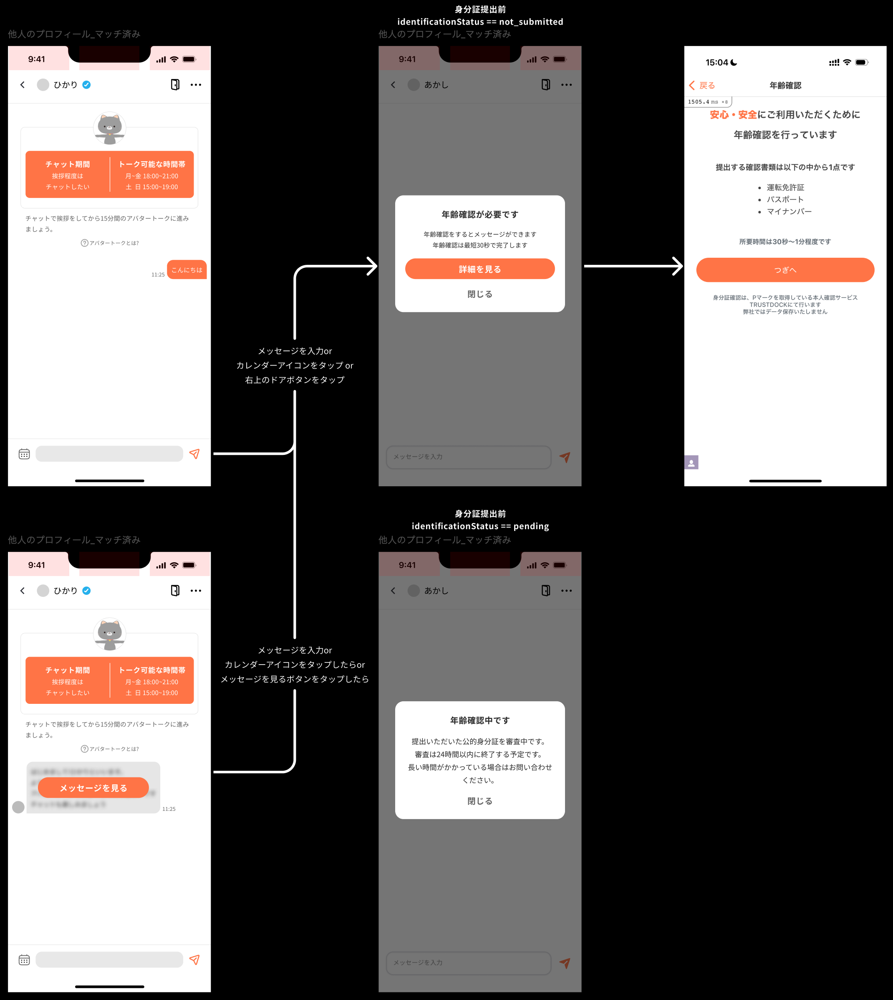

**設楽広太 / Kota Shidara**

1997年生まれ、[X](https://x.com/3tdara)、[Facebook](https://www.facebook.com/kota.shidara)、[Zenn](https://zenn.dev/dara)、[GitHub](https://github.com/kota-shidara)、[SpeakerDeck](https://speakerdeck.com/dara_dara)

# 職務要約
東京大学工学部社会基盤学科在学中の2019年に、株式会社Flamersを3人で共同創業。長期インターンサイトを開発・運営し黒字化を達成した後、新規事業としてメタバースマッチングアプリ[Memotia](https://memotia.com/)を立ち上げた。ANRI等を引受先として[シード資金を調達](https://prtimes.jp/main/html/rd/p/000000010.000053336.html)、CTOに就任（2022年）。プロトタイプをリリースしながらエンジニア採用を進め、最大でエンジニア組織10名強、全社25名程度の組織をリードした。CTOとして、Rails/Go/AWS/Unity/iOS/Androidといった全技術領域のコードをコミットしつつ、スクラムの導入、Issue作成、プロダクト企画、1 on 1などのプロジェクト・プロダクト・ピープルマネジメントを行った。累計調達額2億円以上、累計登録者数万人、LTVベースでの黒字化（収益 > 広告費）、10件以上の成婚を達成。経営状況を踏まえた判断により、2025年10月にCTOを退任。

# 強みと経験
- **広い技術領域の習得**: CTOとして、サーバー/インフラ/クライアントの全領域をカバーしてきた。リリースの期日と品質に責任を持ち、遅れが発生している領域は自ら実装することでプロジェクトを前に進め、緊急のバグフィックスも担当。新しい技術の素早いキャッチアップには自信がある。
- **チーム・プロジェクトマネジメントの経験**: CTO/EMとして10名規模の開発チームをマネジメント。全Issueのうち8割ほどを自身が作成・アサインし、コードレビューまで一貫して実施。サーバー/クライアント間でスムーズに開発が進むよう、タスクの順序や役割分担を設計したことは、自身の技術範囲の広さゆえに特に強みとなった。「開発が楽しい」という感情をメンバーが持ち続けられることを大事にし、離職もほぼゼロの明るいチームを維持した。
- **経営視点**: 創業から資金調達まで経験し、経営者として6年間企業を運営してきた。VRデバイスの普及予測をもとに事業計画を作成しピッチを行ったほか、資金繰りと投資領域を踏まえた採用計画の立案、雇用終了の判断とそのコミュニケーションも担った。
- **プロダクトへの関心と消費者視点**: 技術だけでなく、UI・UXにも関心が高い。他社アプリのリサーチを行い、自らFigmaでデザインした施策を実装し、数値的成果を挙げた。顧客インタビューや自分自身をユーザー視点に置き換える「憑依」のような観点を通じて、一次情報の取得を重視している。
- **技術の掘り下げ**: 技術を深く理解するため、実験を通じて挙動を体感的に理解することを重視している。具体的には、以下のアウトプットがその一例である:
  - [トランザクション分離レベル](https://zenn.dev/dara/articles/22463be74ac059)、[RailsのORMの挙動・速度比較](https://zenn.dev/dara/articles/80b619ae38a543)、[技術書理解（例: Effective C#）](https://zenn.dev/dara/scraps/63854485fc53cf)

# 職歴（株式会社Flamers - CTO、2019/8~2025/10）
CTOとしてメタバースマッチングアプリの開発をリード（Rails/Go/AWS/Unity/iOS/Android）
## サーバー
- **ポリモーフィックなモデル設計**: サーバーにおけるUser/Guestの二系統を、共通のAccountableインターフェースとしてポリモーフィックに設計。運用中も負債になりにくく、コード重複を大幅に削減した。
- **Redisを利用した高速化**: ユーザー同士（男性×女性）のリアルタイムマッチメイキングを高速化するため、事前に相性をバッチ計算しRedisに保存する方式に変更。100人×100人の組み合わせにおいて、処理時間を450秒から220秒に短縮した。
- **MySQLのトランザクションと行ロックの挙動を掘り下げたバグ解消**: トランザクション内で行ロックを用いる処理において、ほぼ同時に処理が呼ばれた場合にテーブル間の不整合が発生するバグを解消した。トランザクション分離レベルごとの読み込み挙動を整理し、さらにトランザクション内でロックを用いた場合に、テーブル間で最新スナップショット時刻がずれる現象を特定した。[調査の概要はこちら](https://zenn.dev/dara/articles/22463be74ac059)
- **Apple/Googleのサブスクリプション実装等**: サーバーの設計（サーバー通知の処理）とクライアント実装を、公式ドキュメントおよび技術検証を行い横断して整備した（実装は主にAndroidを担当し他はディレクション）。リリース後にも実データを検証し、データの信頼性を確認した（[検証ログiOS版](https://zenn.dev/link/comments/4ea2cd272e3784)、[Android版](https://zenn.dev/link/comments/1fa236836939ed)）。同様に、Sign in with Appleも実装とディレクションを行った。[調査ログ](https://zenn.dev/dara/scraps/e659306593b8e7)
- **AWS Lambdaを利用した並列化**: MiniMagickによる画像処理が並列化できず、1分あたり150人分の処理要件下で総処理時間が5分を超える課題があった。ボトルネックとなっていた処理をLambdaへ切り出し、並列実行する構成とすることで、要件を満たす処理時間まで短縮した。

## インフラ
- **AWS CDKを用いて、ECS on EC2構成のWebRTCサーバーを構築**: AWS CDKを用いて、ECS on EC2上で動作するGo言語製サーバーを構築。このサーバーはWebRTCを用いてユーザーの音声をリアルタイムにGoogleの文字起こしAPIへストリーミングするものであり、WebRTC通信のために大量のポートを開放してUDP通信を行う必要があった。FargateとEC2の選択肢の中で、構成のシンプルさとレイテンシの低さの観点からEC2を選択し、ネットワークモードをhostとした。ネットワークモードがhostであることの[デメリット（ポート再マップ制限とセキュリティ）](https://docs.aws.amazon.com/ja_jp/AmazonECS/latest/developerguide/networking-networkmode-host.html)も、今回の要件においては許容可能と判断した。
- **定期実行を安定して実行する基盤の設計**: 構成変更前は、定期実行JobをRailsコンテナ上のcronで実行していた。このため、「同一Jobが重複実行される可能性があり、サーバーを水平スケーリングできない」「何かの理由でcronプロセスがゾンビ化するとJobが実行されない」の2つの課題があった。[sidekiq](https://github.com/sidekiq/sidekiq) / [sidekiq-cron](https://github.com/sidekiq-cron/sidekiq-cron)を導入し、前者の問題はキューイングの排他制御で、後者の問題はsidekiqのプロセスを（Railsコンテナとは別の新たな）コンテナのフォアグラウンドプロセスとすることで、死活監視とAWS側の自動再起動により解決を図った。このインフラ構成の変更とともにAWS CDKを用いたIaC化も行い、成功した（メンバーと共に実施）。
- **その他のインフラ関連の活動**:
  - [AWS WAF](https://aws.amazon.com/jp/waf/)を用いて、海外からの不正アクセスを遮断した。
  - [AWS Elastic Beanstalk](https://aws.amazon.com/jp/elasticbeanstalk/)を利用して、3つのサーバー環境を構築した（IaC導入以前）。

## クライアント（iOS/Android/Unity）
- **モバイルUIとUnityが共存する技術選定**: モバイルUIとUnityの共存のため、Unity as a Libraryを選定・実装した（[技術調査ログiOS版](https://zenn.dev/flamers/articles/3cd8f4781b4892)、[Android版](https://zenn.dev/flamers/articles/aeadd5c721a0d6)）。既存でVRとPCプラットフォームのみで動作していたアプリを、2.5ヶ月でiOS/Androidともに審査を通過させ、リリースを実現した。
- **VRマルチプラットフォーム対応**: Meta社のOculusに特化したSDKではなく、多様なVR機器に対応できるOpenXR / Unity XR Interaction Toolkitを選定した。当時はVR開発に関する情報が少なく、環境変化も激しい中で、VR系の開発を行う知人やX上で見かけた方にDMで連絡し、壁打ちを行った。

## 開発生産性・マネジメント
- **CI/CDの構築**: GitHub ActionsでUnity/モバイルのビルドパイプラインを構築した（対象プラットフォーム・APIの接続先・軽量化・開発者モード等の切替が可能）。また、AWS CDKでCodePipeline、CodeBuildを用いた自動デプロイ機構を構築した。
- **スクラムの導入と定期的な見直し**: 
  - スクラム開発を導入し、スプリントプランニング、デイリースクラム等のイベントを定着させた。
  - ある時期に企画チームと開発チームに分断を感じたため、プロジェクトごとにPM・デザイナー・エンジニアで短時間のミーティングを週2回ほど開催。結果、コミュニケーション頻度が増え、意図の伝達がスムーズになり、エンジニアメンバーがより前向きに企画の実装に向き合えるようになった。
  - スプリントレトロスペクティブのフォーマットを、KPTから[Fun Done Learn](https://www.ogis-ri.co.jp/otc/hiroba/others/ActivityPocket/FunDoneLearn.html)に切り替えて、より明るい雰囲気にすることを模索した。
- **チームへのコード生成AI活用促進**: DevinやClaude Codeの活用を促すミーティングを設定し、その場でハンズオンを実施するとともに、プロンプト例などをまとめた自作ドキュメントを配布。ほぼ全てのメンバーが利用し、さらにrulesの整備も活性化した。使用感の振り返り会を実施し、Devinに関してはフィードバック内容を開発元に送信した。
- **開発合宿の企画**: リリース目標に対して開発がビハインドしている時期に、任意参加で休日に楽しく稼働してもらえるよう、合宿と銘打った企画を実施した。ランチを豪華なものとしたり、進捗をチーム全体に自慢するなどして、楽しいお祭のようなイベントだと感じてもらえるよう工夫した。
- **社内勉強会の開催**: 以下内容の勉強会を開催し講師を務めた（リンクは発表資料）。
  - [SOLID原則](https://speakerdeck.com/dara_dara/ri-chang-tozhao-rasihe-waseteli-jie-surusolidyuan-ze)、[教師あり学習（scikit-learn）](https://colab.research.google.com/drive/1NECwEotE8TD__Usse0vCexMSBXOWLXkh?usp=sharing)、[GAS](https://flamers.notion.site/GAS-3302cf0d4eae413b9d08d0d3cab58c66?source=copy_link)、各種アルゴリズム（二分探索、DP、グラフアルゴリズム）

## UI/UX企画
マッチングアプリにおける企画からFigmaでのUIデザイン・実装までを一貫して担当し、数値的な成果を挙げた。
- **通話実施率の向上**: 通話に至らない原因として、「相手が通話をしたいか分からない」という課題があることを、実際のチャットを140組分析して特定した。相手の意図を可視化する機能を企画し、通話実施率を男性16→25% / 女性17→22%に向上。（分析・企画・UIデザイン・サーバー・モバイル実装を自身が担当した）

- **身分証提出率の向上**: 身分証提出に関するモチベーション設計を他社アプリを参考に企画した。段階的に提出を求める設計と、相手のメッセージをぼかした状態から閲覧できる導線を実装。結果、男性の提出率を48→54%に向上させ、女性は62→60%とほぼ横ばいで推移した。

---

# 以下、Appendix
## 技術スタック
### 言語/フレームワーク
- プロダクションのコードを書いた経験があるもの
  - Ruby / Ruby on Rails（7年）
  - C# / Unity（4年）
  - Kotlin / Jetpack Compose（2年）
  - Swift / SwiftUI（2年）
- 一定期間実務・個人開発で利用したもの
  - Python（卒論の画像キャプション、NumPy・pandas・scikit-learn、Flask、アルゴリズム実装、ROS 2）
  - Go（プロダクションでWebRTCを用いたサーバー構築のレビューとバグフィックスを担当、プライベートでgRPCの学習）
  - JavaScript、TypeScript（プロダクションでRailsのStimulus、GAS、AWS CDKの実装で利用）
- 技術検証レベルで触ったもの
  - Dart / Flutter（技術検証程度）

### クラウドインフラ
- AWS（5年）
  - EC2、ECS、Fargate、Lambda等の基本的なサービスの構築・運用経験
  - CodePipeline、CodeBuild等を利用したCI構築
  - AWS CDKでのIaC構築
- GCP
  - プロダクションで利用するPub/Subの構築（Androidのサブスクサーバー通知）

### その他
- GitHub Actions（実務で利用）
- Docker（実務で利用）
- MySQL（実務で利用）
- Kubernetes（プライベートで学習。Pod、Service、Deployment等の簡単な理解）
- Git, GitHub（実務で利用）
- Dify（実務で利用）
- Figma（利用歴: 半年）

## アウトプット
### 登壇

| 時期 | イベント | スライド |
| --- | --- | --- |
| 2023/9 | CA.Unity #7 | [Windows/Macの証明書の取得と、署名済みインストーラーを作成するビルドプロセスの紹介](https://learning.unity3d.jp/9921/) |
| 2023/6 | （主催）[Unity/VR開発 ◯◯はいいぞ選手権](https://flamers.connpass.com/event/284221/) |  [Zip配布の卒業 インストーラーはいいぞ！](https://speakerdeck.com/dara_dara/zippei-bu-nozu-ye-insutorahaiizo) |
| 2023/3 | [IwakenLabオールスターLT祭 ～XR好き40名大集結～](https://iwakenlab.connpass.com/event/270558/) | [素早いリリースと自身のCTO化を実現した爆速成長サイクルを振り返る](https://speakerdeck.com/dara_dara/iwakenlab-2023ltji)
| 2023/1 | IDEACTIVE（初心者必見！XRビジネス＋開発スタートダッシュ講座） |  [初心者必見！Unityを用いた、cluster worldと自作VRアプリの作り方](https://speakerdeck.com/dara_dara/tesuto)
| 2023/1 | （企画から登壇まで）[設計談義会](https://iwakenlab.connpass.com/event/271524/) | [日常と照らし合わせて理解するSOLID原則](https://speakerdeck.com/dara_dara/ri-chang-tozhao-rasihe-waseteli-jie-surusolidyuan-ze)
| 2022/9 | [VRM勉強会](https://vrm.connpass.com/event/260117/) | [自作アプリにおける、キャリブレーションや表情設定とマルチプレイ同期](https://speakerdeck.com/dara_dara/vrmabatanokiyariburesiyonyabiao-qing-she-ding-tomarutipureitong-qi)

### 執筆

#### 書籍

-  [XR好きのための役立つTips集](https://www.amazon.co.jp/XR%E5%A5%BD%E3%81%8D%E3%81%AE%E3%81%9F%E3%82%81%E3%81%AE%E5%BD%B9%E7%AB%8B%E3%81%A4Tips%E9%9B%86-%E6%8A%80%E8%A1%93%E3%81%AE%E6%B3%89%E3%82%B7%E3%83%AA%E3%83%BC%E3%82%BA-%E5%A0%A4-%E6%B5%B7%E6%96%97/dp/4295602043)
    - MetaのAppLab（現在は廃止）にアプリをリリースするまでの手順をまとめて執筆

#### Zenn
- [TOKYO GAME SHOW（等ビッグイベント）における、デモ展示の技術責任者の心得](https://zenn.dev/flamers/articles/8609b9002d992a)
- [CTO/エンジニアリングマネージャー 1年目の軌跡](https://zenn.dev/flamers/articles/924e3eb0c4d464)

### その他
- Meta Quest向けのカジュアルゲームをリリース（制作期間2ヶ月） [MagicBattlesVR](https://sidequestvr.com/app/4841/magicbattlesvr)

## 学歴/研究
- 東京大学理科一類入学 → 工学部社会基盤学科卒業（2年間の休学）
- 卒業論文 [画像キャプション技術を活用した橋梁点検用Webシステムの開発](https://www.jstage.jst.go.jp/article/jsceiii/3/J2/3_65/_article/-char/ja/) （CNN/LSTMを用いた画像キャプション技術のWebシステムの構築）
- 土木学会・インフラデータチャレンジ [アイデア部門優秀賞受賞](https://www.kensetsunews.com/web-kan/315861)
- ブリティッシュコロンビア大学（バンクーバー）へ1ヶ月の短期留学

## 資格等
- 実用英語技能検定 準1級（2015年）
- IELTS 7.0（2019年）

## その他
- 趣味で3曲を作曲 [YouTube](https://www.youtube.com/@%E3%81%93%E3%81%93%E3%81%BD%E3%82%93%E3%81%A0%E3%83%BC%E3%82%89)
- Voicy公式ITビジネスニュースにおいて、2021/2~2022/1の1年間、火曜日パーソナリティを担当 [放送例](https://voicy.jp/channel/480/223983)